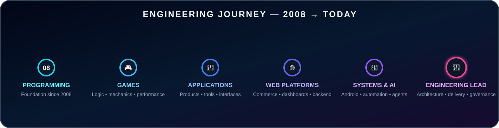
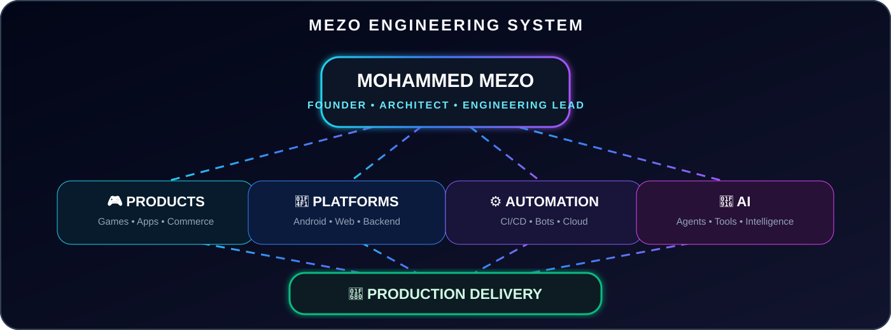

<p align="center">
  
</p>

<p align="center">
  <a href="https://deadzone.web.id/"></a>
  <a href="https://t.me/xDeadZone"></a>
  <a href="https://t.me/DeadZoneDiscussion"></a>
  <a href="https://t.me/MohamedMezo1"></a>
</p>

<p align="center">
  
</p>

<p align="center">
  
  
  
  
</p>

---

# 👑 Executive engineering profile

I am **Mohammed MEZO** — a multi-domain software engineer, product architect, technical founder, and engineering leader whose programming journey began in **2008**.

My work spans **game development, applications, web platforms, Android operating systems, backend services, cloud delivery, automation infrastructure, digital commerce, and AI-enhanced products**. I operate across the complete product lifecycle: vision, architecture, implementation, infrastructure, validation, deployment, release governance, and continuous evolution.

Today, I lead **DeadZone** as Founder and Engineering Lead. I do not treat software as disconnected features. I build engineering systems that repeatedly transform an idea into a stable, maintainable, deployable product.

> **I do not only write code. I architect products, automate execution, govern quality, and lead delivery from concept to production.**

<p align="center">
  
</p>

---

# 🧠 MEZO engineering system

<p align="center">
  
</p>

- 🎮 **Products:** games, mobile applications, business tools, and commerce experiences.
- 📱 **Platforms:** Android systems, websites, APIs, dashboards, and backend services.
- ⚙️ **Automation:** CI/CD, bots, build systems, cloud workflows, and release operations.
- 🤖 **AI:** agents, connected tools, intelligent automation, and engineering acceleration.

Everything converges into one outcome: **production delivery**.

---

# 🏆 Strategic engineering portfolio

<table>
<tr>
<td width="50%" valign="top">

**🧬 DeadZone ROM Platform**  
A controlled Android engineering ecosystem covering architecture, framework integration, device adaptation, validation, release governance, and platform reliability.

**Leadership scope:** Product direction · architecture ownership · release policy · operational standards  
**Visibility:** Controlled distribution · selected public releases

</td>
<td width="50%" valign="top">

**⚙️ DeadZone Build Factory**  
A private build and release environment for firmware extraction, patch orchestration, compatibility verification, packaging, checksums, artifacts, and governed delivery.

**Leadership scope:** Build architecture · automation strategy · quality gates · delivery controls  
**Visibility:** Private engineering infrastructure

</td>
</tr>
<tr>
<td width="50%" valign="top">

**🤖 MEZO AI Systems**  
Connected AI agents and engineering tools designed to reduce repetitive work, accelerate execution, improve decision visibility, and coordinate complex development workflows.

**Leadership scope:** Agent architecture · tool integration · supervised automation · operational intelligence  
**Visibility:** Private product and engineering systems

</td>
<td width="50%" valign="top">

**🛍️ Digital Commerce Engineering**  
Product and systems engineering for catalogs, orders, dashboards, business operations, visual identity, deployment, analytics, and workflow automation.

**Leadership scope:** Product architecture · business systems · delivery operations · continuous optimization  
**Visibility:** Commercial and controlled-access platforms

</td>
</tr>
<tr>
<td width="50%" valign="top">

**🎮 Game Development Lab**  
Interactive systems built around real-time logic, mechanics, timing, performance, feedback loops, experience design, and measurable system behavior.

**Leadership scope:** System design · gameplay logic · performance strategy · product execution  
**Visibility:** Private development portfolio

</td>
<td width="50%" valign="top">

**🌐 Web Platforms**  
Production-grade websites, dashboards, APIs, control panels, backend-connected interfaces, deployment systems, and operational products.

**Leadership scope:** Platform architecture · backend integration · security · deployment governance  
**Visibility:** Public products and private client systems

</td>
</tr>
</table>

> **Repository access is intentionally curated. Core products, internal tooling, signing infrastructure, automation logic, and commercial systems remain private by design.**

---

# 📚 Engineering case studies

<table>
<tr>
<td valign="top">

**CASE 01 · 🧬 DeadZone ROM Engineering**

**Challenge**  
Transform Android firmware work from manual modification into a controlled, repeatable product-delivery process.

**Engineering response**  
Source assessment → extraction → platform detection → framework and vendor integration → compatibility validation → packaging → integrity controls → governed release.

**Business and engineering outcome**  
A reusable platform direction capable of supporting multiple ROM editions, controlled device adaptation, automation, quality gates, and long-term release governance.

</td>
</tr>
<tr>
<td valign="top">

**CASE 02 · 🤖 AI-Assisted Engineering Platform**

**Challenge**  
Reduce context switching and repetitive manual work across development, repositories, builds, deployment, releases, and operations.

**Engineering response**  
Connected agents, repository-aware tooling, permission-controlled actions, workflow orchestration, persistent state, and human-supervised execution.

**Business and engineering outcome**  
Faster iteration, stronger visibility, lower operational friction, and a foundation for intelligent engineering workflows without surrendering control.

</td>
</tr>
<tr>
<td valign="top">

**CASE 03 · 🛍️ Digital Commerce Systems**

**Challenge**  
Build an operational commerce platform rather than a visual storefront with disconnected business processes.

**Engineering response**  
Structured catalogs, order operations, merchandising logic, dashboards, automation, deployment pipelines, analytics, and controlled product presentation.

**Business and engineering outcome**  
A maintainable digital operating system designed to support daily execution, customer experience, business visibility, and continuous product improvement.

</td>
</tr>
</table>

---

# 🎯 What I deliver

<table>
<tr>
<td width="50%" valign="top">

- 🚀 Product ideas converted into production systems
- 🏛️ Architecture that remains clear as complexity grows
- ⚙️ Automated build, validation, deployment, and release operations
- 📱 Delivery across Android, applications, web, backend, and cloud

</td>
<td width="50%" valign="top">

- 🤖 AI integrated where it creates measurable leverage
- 🛡️ Quality, integrity, traceability, permissions, and rollback discipline
- 📦 End-to-end ownership from planning through post-release support
- 📈 Systems that improve after every failure and iteration

</td>
</tr>
</table>

<p align="center">
  
</p>

---

# 🔬 Engineering operating model

```text
01  VISION & PRODUCT DIRECTION
                ↓
02  REQUIREMENTS & ARCHITECTURE
                ↓
03  ENGINEERING & INTEGRATION
                ↓
04  AUTOMATION & QUALITY GATES
                ↓
05  SECURITY / INTEGRITY / VALIDATION
                ↓
06  DEPLOYMENT & RELEASE GOVERNANCE
                ↓
07  OBSERVABILITY / SUPPORT / ITERATION
```

<p align="center">
  
</p>

> **Operating principle:** every product is managed as a complete delivery system. Architecture, implementation, validation, deployment, observability, and support belong to one continuous engineering lifecycle.

---

# 🛡️ Engineering principles

<table>
<tr><td><b>🏛️ Architecture before complexity</b></td><td>Define structure, ownership, boundaries, and interfaces before expanding features.</td></tr>
<tr><td><b>⚙️ Automation before repetition</b></td><td>Repeated manual work becomes a controlled tool, workflow, or pipeline.</td></tr>
<tr><td><b>✅ Evidence before release</b></td><td>No serious release is complete without validation, traceability, and observable results.</td></tr>
<tr><td><b>🚀 Products, not demos</b></td><td>Engineering succeeds when the result is usable, maintainable, and supportable.</td></tr>
<tr><td><b>🤖 AI as infrastructure</b></td><td>AI belongs inside workflows where it creates reliable leverage and operational value.</td></tr>
<tr><td><b>🧭 Ownership end to end</b></td><td>Responsibility continues from concept and architecture through production support.</td></tr>
<tr><td><b>🔐 Integrity by design</b></td><td>Security, signing, checksums, access controls, and rollback are planned early.</td></tr>
<tr><td><b>📈 Improve the system</b></td><td>Every failure must strengthen the process that allowed it to happen.</td></tr>
</table>

---

# 🔴 Current execution focus

```yaml
active_programs:
  - DeadZone Android engineering platform
  - private automated build and release infrastructure
  - AI-powered engineering and operational tools
  - digital commerce and business platforms

engineering_priorities:
  - platform reliability
  - permission-aware intelligent automation
  - scalable and reusable architecture
  - release integrity and traceability
  - mobile-first product quality
  - controlled visibility and private-by-design systems

execution_direction:
  - stronger delivery systems
  - cleaner operational workflows
  - reusable engineering foundations
  - higher visibility across build and release stages
```

---

# 🧩 Technical capability map

**Android systems**  
`AOSP` `HyperOS` `Framework` `SystemUI` `Services` `Smali` `Vendor` `ODM` `Boot` `Recovery` `AVB`

**Applications and games**  
`Product Architecture` `Interactive Logic` `Performance` `Mobile UX` `Tools` `Utilities`

**Web and backend**  
`Next.js` `React` `Node.js` `TypeScript` `APIs` `Dashboards` `PostgreSQL` `Commerce Systems`

**Build and automation**  
`Python` `Bash` `GitHub Actions` `Docker` `Linux` `Build Matrices` `Artifact Pipelines` `Telegram Bots`

**Infrastructure and delivery**  
`Cloudflare` `Fly.io` `Vercel` `Databases` `Checksums` `Release Automation` `Observability`

<p align="center">
  
</p>

---

# 🧬 DeadZone product portfolio

<table>
<tr>
<td align="center"><b>⚡ Lite</b><br/><sub>Stability-first daily driver</sub></td>
<td align="center"><b>🎮 GamingPlus</b><br/><sub>Performance-oriented system profile</sub></td>
<td align="center"><b>🥷 Ninja</b><br/><sub>Framework-powered integration</sub></td>
</tr>
<tr>
<td align="center"><b>🧩 Port</b><br/><sub>Cross-device adaptation</sub></td>
<td align="center"><b>👑 Legend</b><br/><sub>Advanced flagship direction</sub></td>
<td align="center"><b>🔒 Private Lab</b><br/><sub>Controlled research and tooling</sub></td>
</tr>
</table>

---

# 🌐 Official network

<p align="center">
  <a href="https://deadzone.web.id/"></a>
  <a href="https://t.me/xDeadZone"></a>
  <a href="https://t.me/DeadZoneDiscussion"></a>
  <a href="https://t.me/DeadZoneCloud"></a>
  <a href="https://t.me/MohamedMezo1"></a>
</p>

---

<p align="center">
  <strong>✨ PROGRAMMER SINCE 2008 • ENGINEERING LEAD • GAME DEV • APP DEV • WEB DEV • ANDROID SYSTEMS • AI BUILDER ✨</strong>
</p>

<p align="center">
  <sub>ARCHITECT THE PLATFORM · AUTOMATE THE EXECUTION · GOVERN THE QUALITY · SHIP THE PRODUCT</sub>
</p>
