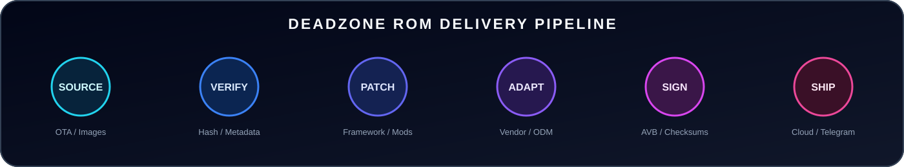

<p align="center">
  
</p>

<p align="center">
  <a href="https://deadzone.web.id/">
    
  </a>
  <a href="https://t.me/xDeadZone">
    
  </a>
  <a href="https://t.me/DeadZoneDiscussion">
    
  </a>
  <a href="https://t.me/MohamedMezo1">
    
  </a>
</p>

<p align="center">
  
  
  
</p>

---

# Executive profile

I am **Mohammed MEZO**, Founder and Engineering Lead of **DeadZone ROM**. I lead the technical direction and end-to-end delivery of Android platform products—from source evaluation and architecture decisions to framework integration, device adaptation, automated validation, release governance, and production support.

My work is centered on building **reliable engineering systems**, not isolated modifications. I design the architecture, automation, quality controls, and operational workflows required to transform Android firmware into maintainable products that can be built, verified, distributed, and supported consistently.

> **I do not only build ROMs. I build the engineering platform that produces them.**

## Leadership scope

- **Technical strategy:** define the Android platform roadmap, product direction, priorities, and delivery standards.
- **Architecture ownership:** design modular ROM workflows across framework, SystemUI, services, vendor, ODM, boot, recovery, and packaging layers.
- **Delivery management:** coordinate build pipelines, release gates, artifact publishing, changelogs, and distribution operations.
- **Quality governance:** establish verification, compatibility, integrity, rollback, and release-readiness controls.
- **Automation leadership:** replace repetitive manual work with reproducible tooling, CI/CD, bots, and cloud workflows.
- **Operational responsibility:** manage release communication, build visibility, issue triage, and post-release support.

<p align="center">
  
</p>

---

# DeadZone engineering organization

## Android platform engineering

I work below the application layer across **AOSP, HyperOS, framework, SystemUI, Android services, vendor, ODM, boot images, recovery, AVB-aware packaging, and device compatibility**.

The objective is not simply to make a build boot. The objective is to deliver a platform that is structured, testable, repeatable, and supportable.

## Build and release engineering

DeadZone delivery is designed around controlled, reproducible stages:

```text
SOURCE ASSESSMENT
      ↓
ARCHITECTURE & COMPATIBILITY PLAN
      ↓
EXTRACTION & PLATFORM DETECTION
      ↓
FRAMEWORK / SYSTEM / VENDOR INTEGRATION
      ↓
AUTOMATED VALIDATION & QUALITY GATES
      ↓
PACKAGING / SIGNING / CHECKSUMS
      ↓
CONTROLLED RELEASE & OBSERVABILITY
```

## Device enablement

Cross-device delivery requires more than file replacement. My work covers platform differences, partition layouts, vendor and ODM adaptation, framework compatibility, boot behavior, recovery integration, camera components, performance profiles, and device-specific release policies.

## Engineering operations

I build the supporting systems around the ROM itself: GitHub Actions pipelines, Telegram control workflows, build state management, artifact delivery, database-backed automation, cloud services, release notifications, and operational safeguards.

<p align="center">
  
</p>

---

# DeadZone product portfolio

### DeadZone Lite
A clean daily-driver edition focused on stability, controlled optimization, and dependable release behavior.

### DeadZone GamingPlus
A performance-oriented edition with a gaming-focused configuration and specialized system tuning.

### DeadZone Ninja
A framework-powered edition built around deeper system integration and modular feature delivery.

### DeadZone Port
A cross-device engineering line focused on adaptation, vendor compatibility, and platform migration.

### DeadZone Legend
An experimental flagship line used for advanced integration, validation, and next-generation platform work.

---

# Engineering standards

Every serious release should satisfy the same operational principles:

- **Reproducibility:** the same inputs and configuration should produce a traceable result.
- **Integrity:** artifacts, checksums, signing state, and package structure must be verifiable.
- **Compatibility:** framework, vendor, ODM, boot, recovery, and device behavior must be evaluated together.
- **Maintainability:** modifications should be modular, documented, and replaceable without rebuilding the entire workflow.
- **Observability:** build stages, failures, release state, and delivery status should be visible.
- **Release discipline:** no build is considered complete until validation, packaging, documentation, and distribution are complete.

```yaml
release_policy:
  source_verified: true
  compatibility_reviewed: true
  patches_traceable: true
  automated_checks_passed: true
  artifacts_hashed: true
  release_notes_prepared: true
  rollback_path_defined: true
```

---

# Technical capabilities

**Android internals**  
`AOSP` `HyperOS` `SystemUI` `Framework` `Services` `Smali` `Vendor` `ODM` `Boot` `Recovery`

**Build and automation**  
`GitHub Actions` `Docker` `Bash` `Python` `Linux` `Build Matrices` `Artifact Pipelines`

**Languages**  
`Kotlin` `Java` `C` `C++` `Python` `Bash` `JavaScript` `TypeScript`

**Platform operations**  
`Telegram APIs` `Cloudflare` `Fly.io` `Vercel` `PostgreSQL` `Checksums` `Release Automation`

<p align="center">
  
</p>

---

# Current engineering focus

- Unifying DeadZone variants around a controlled platform architecture.
- Increasing build reproducibility and reducing manual release operations.
- Expanding framework patching through modular, auditable packages.
- Strengthening integrity checks, metadata validation, and release traceability.
- Improving device onboarding, compatibility policies, and platform reuse.
- Building a central control layer for builds, state, artifacts, and release communication.

---

# Official DeadZone channels

<p align="center">
  <a href="https://deadzone.web.id/">
    
  </a>
  <a href="https://t.me/xDeadZone">
    
  </a>
  <a href="https://t.me/DeadZoneDiscussion">
    
  </a>
  <a href="https://t.me/DeadZoneCloud">
    
  </a>
</p>

<br />

<p align="center">
  <strong>ARCHITECT THE PLATFORM · AUTOMATE THE DELIVERY · GOVERN THE RELEASE</strong>
</p>

<p align="center">
  <sub>DeadZone ROM Engineering · Mohammed MEZO</sub>
</p>
