<p align="center">
  
</p>

<p align="center">
  <a href="https://deadzone.web.id/">
    
  </a>
  <a href="https://t.me/xDeadZone">
    
  </a>
  <a href="https://t.me/DeadZoneDiscussion">
    
  </a>
</p>

<p align="center">
  
  
  
  
</p>

<br />

## Engineering Android beyond the app layer

I am **Mohammed MEZO**, an Android systems developer and the founder of **DeadZone ROM**.

My work lives below the application layer: ROM construction, framework modification, device adaptation, automated release pipelines, recovery builds, system hardening, and the infrastructure required to turn raw Android images into dependable releases.

```text
SOURCE / OTA  →  VERIFY  →  EXTRACT  →  PATCH  →  ADAPT  →  REPACK  →  SIGN  →  RELEASE
```

<table>
<tr>
<td width="50%" valign="top">

### Core systems work

- AOSP and custom ROM engineering
- Xiaomi / HyperOS modification
- OnePlus and ODM porting
- Framework, SystemUI and services patching
- Vendor, product, system and boot image handling
- AVB-aware packaging and integrity workflows

</td>
<td width="50%" valign="top">

### Platform engineering

- GitHub Actions build orchestration
- Reproducible ROM pipelines
- Release checksums and changelogs
- Telegram build and release delivery
- Cloud artifact management
- AI-assisted development tooling

</td>
</tr>
</table>

---

## DeadZone engineering platform

<table>
<tr>
<td width="33%" valign="top">

### DeadZone ROM

A custom Android ecosystem built around performance, clean integration, controlled customization, and maintainable device support.

**Areas:** ROM variants, device support, framework features, release operations.

</td>
<td width="33%" valign="top">

### Build Factory

Automated extraction, modification, compatibility processing, repacking, verification, and publishing for Android firmware.

**Areas:** Xiaomi, HyperOS, OnePlus, ODM, OTA and image workflows.

</td>
<td width="33%" valign="top">

### Control Plane

Bots and backend services that coordinate builds, track state, deliver artifacts, publish release information, and reduce manual operations.

**Areas:** Telegram, databases, cloud storage, CI/CD and notifications.

</td>
</tr>
</table>

---

## Selected public work

<table>
<tr>
<td width="50%" valign="top">

### [Xiaomi Stock Toolbuild](https://github.com/hypermezo4-create/xiaomi-stocktoolbuild)

Tooling and automation for stock Xiaomi / HyperOS firmware workflows, image processing, customization, and build delivery.

`Android` `Python` `Shell` `GitHub Actions`

</td>
<td width="50%" valign="top">

### [FrameworkPatcher](https://github.com/hypermezo4-create/FrameworkPatcher)

Android framework patching work focused on repeatable modifications and modular system-level changes.

`Android Framework` `Smali` `Patching` `Automation`

</td>
</tr>
<tr>
<td width="50%" valign="top">

### [DeadZone Build](https://github.com/mohammedmezo99/DeadZone-Build)

Public build and release entry point for DeadZone engineering workflows.

`CI/CD` `Release Engineering` `ROM Builds`

</td>
<td width="50%" valign="top">

### [DeadZone Site Hardening](https://github.com/hypermezo4-create/deadzone-site-hardening)

Security and reliability improvements for the DeadZone web platform and its production surface.

`Web Security` `Hardening` `Production`

</td>
</tr>
<tr>
<td width="50%" valign="top">

### [Action OFRP Builder](https://github.com/hypermezo4-create/Action-OFRP-Builder)

GitHub Actions automation for recovery build workflows and repeatable artifact generation.

`OrangeFox` `Recovery` `GitHub Actions`

</td>
<td width="50%" valign="top">

### [MEZO AI](https://github.com/hypermezo4-create/MEZO_Ai)

AI-assisted tooling and automation experiments supporting development and operational workflows.

`AI Tools` `Automation` `Developer Experience`

</td>
</tr>
</table>

> Public Android and tooling repositories are also maintained through **[@hypermezo4-create](https://github.com/hypermezo4-create)**.

---

## System delivery pipeline

```mermaid
flowchart LR
    A[ROM Source / OTA] --> B[Integrity Verification]
    B --> C[Payload & Image Extraction]
    C --> D[Platform Detection]
    D --> E[Base Compatibility Layer]
    E --> F[Framework & Feature Patches]
    F --> G[Vendor / ODM Adaptation]
    G --> H[Filesystem Repack]
    H --> I[AVB / Signing / Checksums]
    I --> J[Cloud Artifact Delivery]
    J --> K[Telegram Release & Support]
```



---

## Technology stack

<p align="center">
  
</p>

<table>
<tr>
<td><b>Android</b></td>
<td>AOSP, HyperOS, framework, SystemUI, services, vendor, ODM, boot and recovery</td>
</tr>
<tr>
<td><b>Languages</b></td>
<td>Python, Bash, Kotlin, Java, C, C++, JavaScript and TypeScript</td>
</tr>
<tr>
<td><b>Automation</b></td>
<td>GitHub Actions, Docker, build matrices, artifact pipelines and release workflows</td>
</tr>
<tr>
<td><b>Platforms</b></td>
<td>Linux, Cloudflare, Fly.io, Vercel, PostgreSQL and Telegram APIs</td>
</tr>
</table>

---

## Open-source footprint

<p align="center">
  
  
</p>

<p align="center">
  
</p>

---

## Contribution stream

<p align="center">
  
</p>

---

## Contact and community

<p align="center">
  <a href="https://t.me/MohamedMezo1">
    
  </a>
  <a href="https://t.me/xDeadZone">
    
  </a>
  <a href="https://t.me/DeadZoneCloud">
    
  </a>
  <a href="https://deadzone.web.id/">
    
  </a>
</p>

<br />

<p align="center">
  <strong>ENGINEER THE SYSTEM. AUTOMATE THE PIPELINE. SHIP WITH CONFIDENCE.</strong>
</p>
