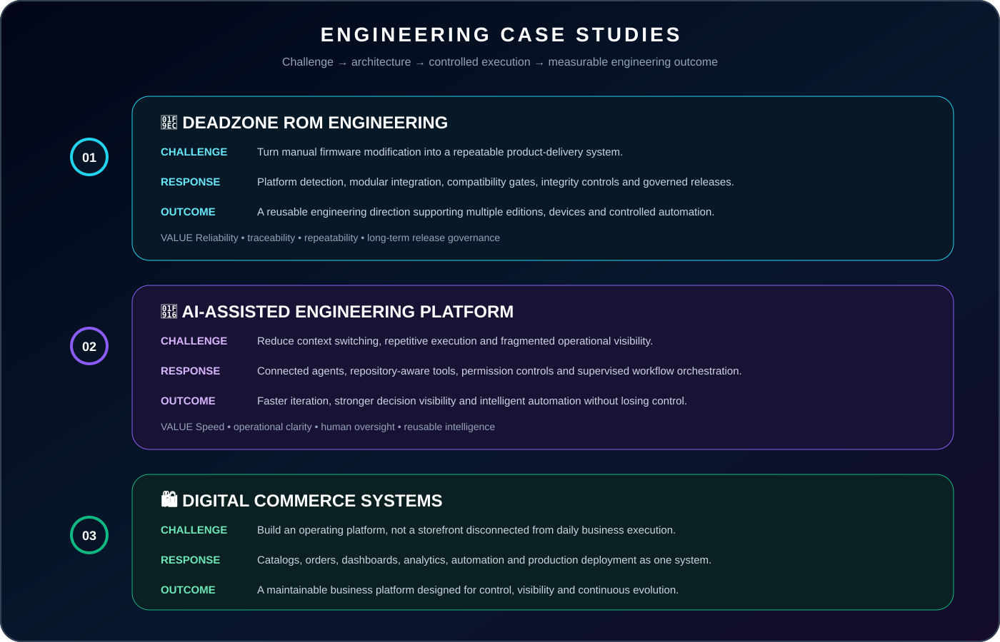

  

  

  
  
  
  

---

# 👑 Executive engineering profile

I am **Mohammed MEZO** — a multi-domain software engineer, product architect, technical founder, and engineering leader whose programming journey began in **2008**.

My work spans **game development, applications, web platforms, Android operating systems, backend services, cloud delivery, automation infrastructure, digital commerce, and AI-enhanced products**.

I operate across the full product lifecycle: **vision → architecture → implementation → infrastructure → validation → deployment → release governance → continuous evolution**.

> **I do not only write code. I architect products, automate execution, govern quality, and lead delivery from concept to production.**

  

---

# 🧠 MEZO engineering system

  

  <strong>PRODUCTS × PLATFORMS × AUTOMATION × AI → PRODUCTION DELIVERY</strong>

---

# 🏆 Strategic engineering portfolio

  

  Repository access is intentionally curated. Core code, signing systems, automation logic, client platforms, and internal tools remain private by design.

---

# 📚 Engineering case studies

  

---

# 🎯 What I deliver

<table>
<tr>
<td width="50%" valign="top">

**🚀 Product execution**  
Ideas converted into maintainable, production-ready systems.

**🏛️ Architecture ownership**  
Clear boundaries, reusable foundations, and controlled complexity.

**⚙️ Delivery automation**  
Build, validation, deployment, and release operations designed as one system.

**📱 Multi-platform engineering**  
Android, applications, web, backend, cloud, and operational tooling.

</td>
<td width="50%" valign="top">

**🤖 Applied AI**  
Intelligence embedded where it creates measurable engineering leverage.

**🛡️ Quality and integrity**  
Traceability, permissions, signing, checksums, validation, and rollback discipline.

**📦 End-to-end ownership**  
Responsibility from product direction through post-release support.

**📈 Continuous improvement**  
Every failure strengthens the system that allowed it to happen.

</td>
</tr>
</table>

  

---

# 🔬 Engineering governance

  

  

---

# 🔴 Current execution focus

  

---

# 🧩 Technical capability map

<table>
<tr>
<td width="33%" valign="top">

**🤖 Android systems**  
`AOSP` `HyperOS` `Framework`  
`SystemUI` `Services` `Smali`  
`Vendor` `ODM` `Boot` `Recovery` `AVB`

**🎮 Applications and games**  
`Product Architecture` `Interactive Logic`  
`Performance` `Mobile UX` `Tools`

</td>
<td width="33%" valign="top">

**🌐 Web and backend**  
`Next.js` `React` `Node.js`  
`TypeScript` `APIs` `Dashboards`  
`PostgreSQL` `Commerce Systems`

**⚙️ Build and automation**  
`Python` `Bash` `GitHub Actions`  
`Docker` `Linux` `Artifact Pipelines`

</td>
<td width="33%" valign="top">

**☁️ Infrastructure and delivery**  
`Cloudflare` `Fly.io` `Vercel`  
`Databases` `Checksums` `Observability`  
`Release Automation` `Telegram Systems`

**🧠 Intelligent systems**  
`AI Agents` `Connected Tools`  
`Workflow Orchestration` `Supervised Actions`

</td>
</tr>
</table>

  

---

# 🧬 DeadZone product portfolio

<table>
<tr>
<td align="center"><b>⚡ Lite</b> Stability-first daily driver</td>
<td align="center"><b>🎮 GamingPlus</b> Performance-oriented profile</td>
<td align="center"><b>🥷 Ninja</b> Framework-powered integration</td>
</tr>
<tr>
<td align="center"><b>🧩 Port</b> Cross-device adaptation</td>
<td align="center"><b>👑 Legend</b> Advanced flagship direction</td>
<td align="center"><b>🔒 Private Lab</b> Controlled research and tooling</td>
</tr>
</table>

---

# 🌐 Official network

  
  
  
  
  

---

  <strong>✨ PROGRAMMER SINCE 2008 • ENGINEERING LEAD • GAME DEV • APP DEV • WEB DEV • ANDROID SYSTEMS • AI BUILDER ✨</strong>

  ARCHITECT THE PLATFORM · AUTOMATE THE EXECUTION · GOVERN THE QUALITY · SHIP THE PRODUCT

