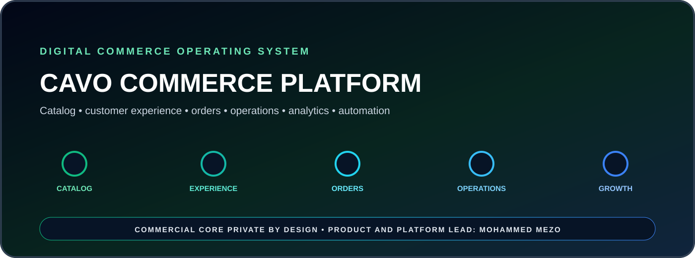

<p align="center"></p>

# Cavo Commerce Platform

**A public product and engineering overview of a private digital commerce operating system.**

Cavo Commerce Platform covers the full digital product layer behind a real commerce business: catalog structure, merchandising, storefront experience, order operations, dashboards, analytics, deployment, automation, and continuous product improvement.

## Engineering scope

- Product catalog and merchandising systems
- Customer-facing web and mobile-first commerce experiences
- Order, inventory and operational workflows
- Dashboards, analytics and business visibility
- Deployment, reliability and workflow automation
- Visual identity and conversion-focused product design

## Product architecture

```text
CATALOG & CONTENT
        ↓
CUSTOMER EXPERIENCE
        ↓
ORDER OPERATIONS
        ↓
BUSINESS DASHBOARDS
        ↓
AUTOMATION & ANALYTICS
        ↓
CONTINUOUS OPTIMIZATION
```

## Visibility policy

> Commercial source code, customer data, business logic, credentials, infrastructure configuration, and internal operating workflows remain private by design.

**Product & Platform Lead:** Mohammed MEZO  
**Focus:** Commerce engineering · product systems · business operations
