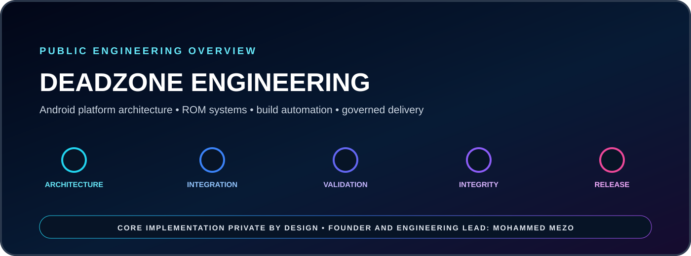

<p align="center"></p>

# DeadZone Engineering

**Public engineering overview of a private-by-design Android platform and release ecosystem.**

DeadZone Engineering represents the product architecture, Android systems work, device adaptation, release governance, automation strategy, and operational standards behind the DeadZone platform.

## Engineering scope

- Android platform architecture and ROM product direction
- Framework, SystemUI, services, vendor, ODM, boot and recovery integration
- Device adaptation and compatibility governance
- Build, validation, packaging, signing and release operations
- Controlled distribution, observability and post-release support

## Operating model

```text
SOURCE ASSESSMENT
        ↓
ARCHITECTURE & COMPATIBILITY
        ↓
SYSTEM INTEGRATION
        ↓
AUTOMATED VALIDATION
        ↓
PACKAGING & INTEGRITY
        ↓
CONTROLLED RELEASE
```

## Visibility policy

> Core source code, signing infrastructure, device-specific implementation, internal automation logic and production operations remain private by design.

**Founder & Engineering Lead:** Mohammed MEZO  
**Programming journey:** Since 2008  
**Official platform:** https://deadzone.web.id/
