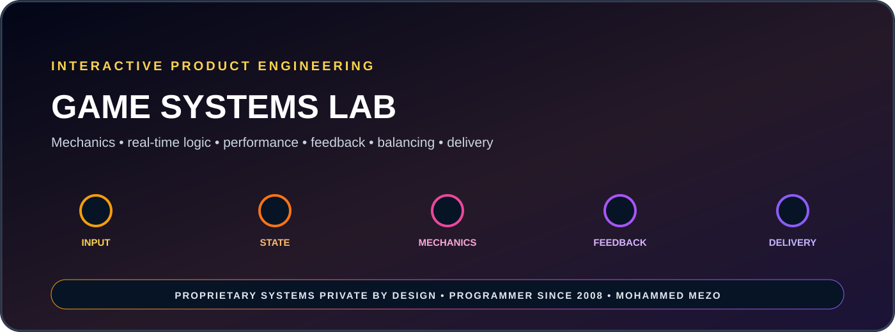

<p align="center"></p>

# Game Systems Lab

**A public engineering overview of private game systems, mechanics, and real-time product development.**

Game Systems Lab presents the systems thinking behind interactive products: mechanics, timing, real-time state, player feedback, performance, balancing, tooling, and production delivery.

## Engineering scope

- Gameplay systems and real-time logic
- Mechanics, timing, state transitions and feedback loops
- Performance profiling and optimization strategy
- Product architecture and reusable game systems
- Development tooling, testing and release preparation
- Experience design grounded in measurable behavior

## Systems model

```text
PLAYER INTENT
      ↓
INPUT & STATE
      ↓
GAMEPLAY RULES
      ↓
REAL-TIME SIMULATION
      ↓
FEEDBACK & BALANCE
      ↓
PERFORMANCE & DELIVERY
```

## Visibility policy

> Source code, proprietary mechanics, commercial assets, internal tooling, production pipelines, and unreleased product concepts remain private by design.

**Game Systems Developer:** Mohammed MEZO  
**Programming journey:** Since 2008  
**Focus:** Interactive systems · mechanics · performance · product execution
