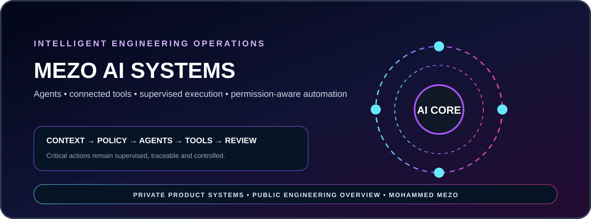

<p align="center"></p>

# MEZO AI Systems

**A public overview of private AI products, connected tools, and supervised engineering automation.**

MEZO AI Systems focuses on using artificial intelligence as controlled engineering infrastructure—not as a decorative feature. The platform direction combines agents, connected repositories, workflow orchestration, persistent state, permission-aware actions, and human supervision.

## Engineering scope

- AI agents for software engineering and operational workflows
- Repository-aware tools and controlled project actions
- Workflow orchestration and persistent execution state
- Human-supervised automation for high-impact operations
- Integration with deployment, communication and business systems

## Architecture direction

```text
USER INTENT
    ↓
CONTEXT & POLICY LAYER
    ↓
AGENT ORCHESTRATION
    ↓
CONNECTED TOOLS
    ↓
SUPERVISED EXECUTION
    ↓
OBSERVABILITY & REVIEW
```

## Visibility policy

> Agent prompts, production connectors, credentials, internal decision logic, customer workflows, and operational automation remain private by design.

**Product & Engineering Lead:** Mohammed MEZO  
**Focus:** AI agents · automation · connected tools · production systems
